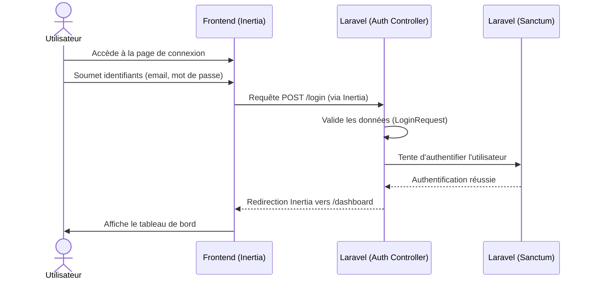
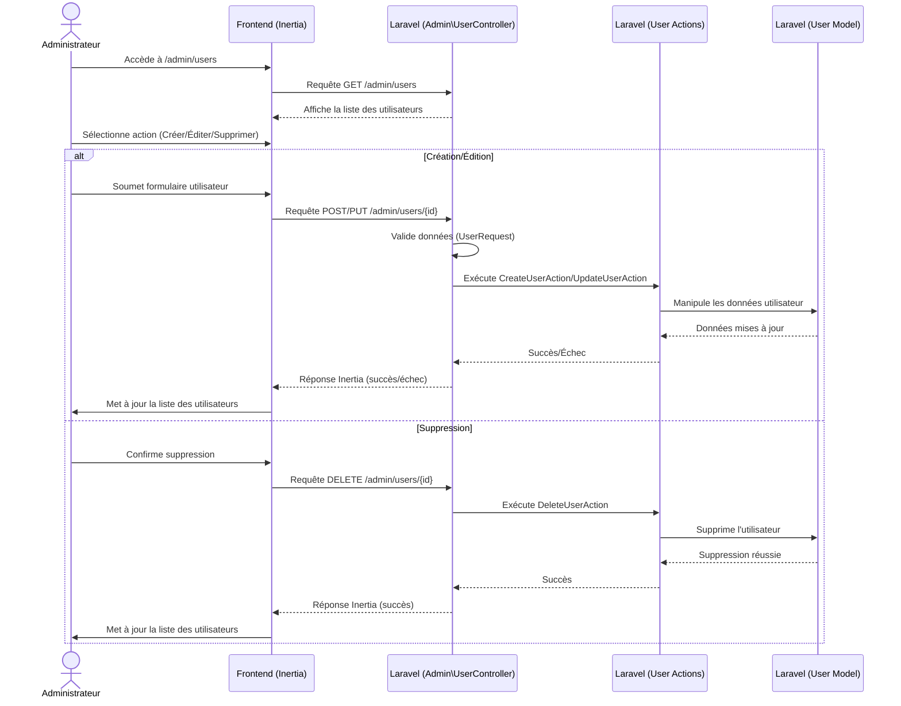
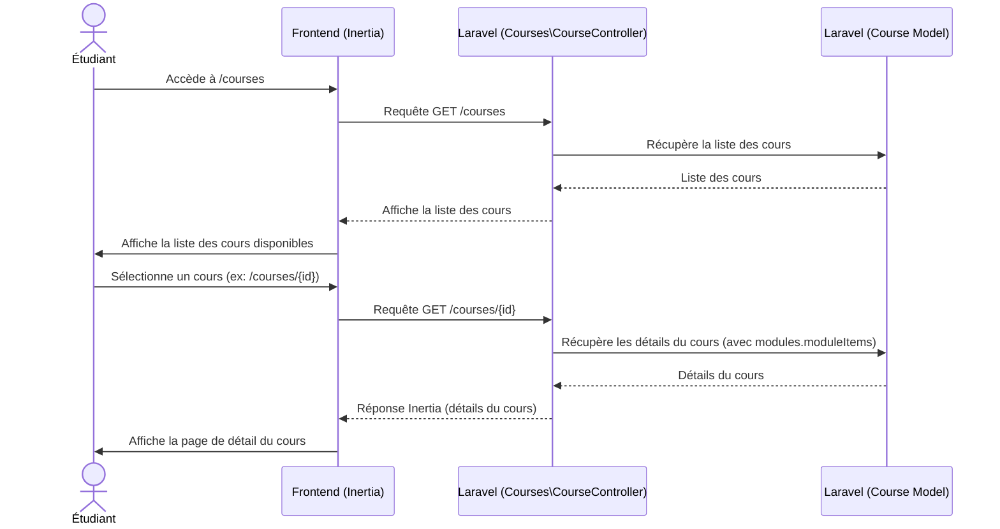
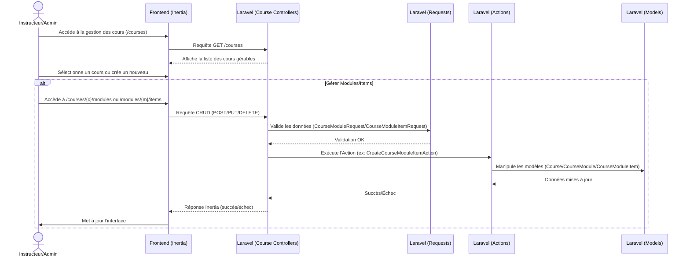
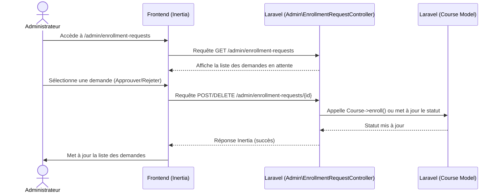
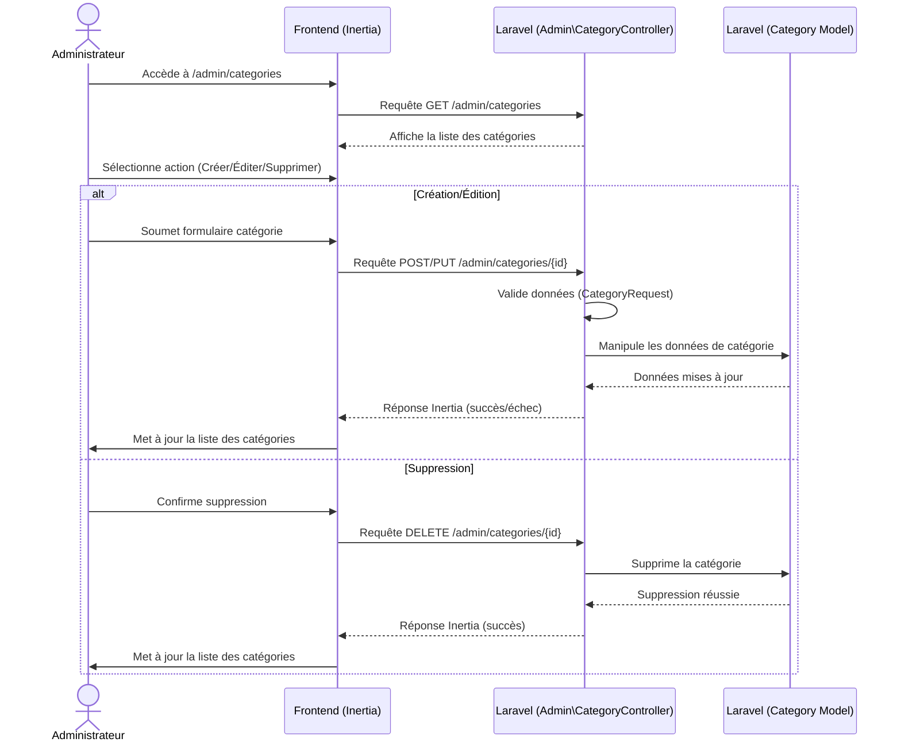

# Rapport de Projet : SmartLearn - Plateforme d'E-Learning

## Table des matières

*   [Introduction générale](#introduction-générale)
*   [Chapitre 1 : Contexte Général du projet](#chapitre-1--contexte-général-du-projet)
    *   [Présentation générale](#présentation-générale)
    *   [Cadre du projet](#cadre-du-projet)
    *   [Présentation du projet](#présentation-du-projet)
    *   [Processus de développement](#processus-de-développement)
    *   [Langage de modélisation](#langage-de-modélisation)
    *   [Planification du projet](#planification-du-projet)
    *   [Conclusion Chapitre](#conclusion-chapitre)
*   [Chapitre 2 : Spécification et analyse](#chapitre-2--spécification-et-analyse)
    *   [Étude de l'existant](#étude-de-lexistant)
    *   [Spécification des besoins fonctionnels](#spécification-des-besoins-fonctionnels)
    *   [Architecture fonctionnelle](#architecture-fonctionnelle)
    *   [Exigences techniques](#exigences-techniques)
    *   [Analyse des besoins](#analyse-des-besoins)
    *   [Diagrammes de cas d'utilisation](#diagrammes-de-cas-dutilisation)
    *   [Conclusion Chapitre](#conclusion-chapitre-1)
*   [Chapitre 3 : Étude conceptuelle](#chapitre-3--étude-conceptuelle)
    *   [Diagrammes de séquence](#diagrammes-de-séquence)
        *   [Diagramme de séquence du scénario « Authentification »](#diagramme-de-séquence-du-scénario--authentification-)
        *   [Diagramme de séquence du scénario « User Management»](#diagramme-de-séquence-du-scénario--user-management-)
        *   [Diagramme de séquence du scénario «cours »](#diagramme-de-séquence-du-scénario--cours-)
        *   [Diagramme de séquence du scénario « Management cours »](#diagramme-de-séquence-du-scénario--management-cours-)
        *   [Diagramme de séquence du scénario « Enrollment Requests»](#diagramme-de-séquence-du-scénario--enrollment-requests-)
        *   [Diagramme de séquence du scénario « Category Management »](#diagramme-de-séquence-du-scénario--category-management-)
    *   [Diagramme de classe](#diagramme-de-classe)
        *   [Diagramme des classes général](#diagramme-des-classes-général)
    *   [Schéma de la base de données](#schéma-de-la-base-de-données)
    *   [Conclusion Chapitre](#conclusion-chapitre-2)
*   [Chapitre 4 : Réalisation](#chapitre-4--réalisation)
    *   [Langages et Frameworks](#langages-et-frameworks)
        *   [Choix du langage et framework de programmation (backend)](#choix-du-langage-et-framework-de-programmation-backend)
        *   [Choix du framework (Frontend)](#choix-du-framework-frontend)
        *   [Choix du base donnée](#choix-du-base-donnée)
        *   [Autre Outils utilisés](#autre-outils-utilisés)
    *   [Spécifications techniques](#spécifications-techniques)
        *   [Les Composants de laravel](#les-composants-de-laravel)
        *   [Les Composants de reactJs](#les-composants-de-reactjs)
        *   [SQLite](#sqlite)
        *   [Crystal Report](#crystal-report)
    *   [Mise en œuvre :](#mise-en-œuvre-)
        *   [Accès à l'application (Authentification)](#accès-à-lapplication-authentification)
        *   [Profil Admin](#profil-admin)
            *   [Dashboard Overview](#dashboard-overview)
            *   [Courses](#courses)
            *   [User Management](#user-management)
            *   [Course Management](#course-management)
            *   [Enrollment Requests](#enrollment-requests)
            *   [Category Management](#category-management)
        *   [Profil Instructors](#profil-instructors)
        *   [Profil Étudiant](#profil-étudiant)
    *   [Conclusion Chapitre](#conclusion-chapitre-3)
*   [Conclusion générale](#conclusion-générale)

---

## Introduction générale

Ce rapport présente le projet "SmartLearn", une plateforme d'e-learning moderne conçue pour faciliter l'éducation en ligne. Inspirée par des systèmes comme Google Classroom, SmartLearn vise à optimiser les processus d'enseignement et d'apprentissage grâce à une interface intuitive et des fonctionnalités robustes. Le système est développé en utilisant une pile technologique full-stack composée de Laravel pour le backend et ReactJS avec Inertia.js pour le frontend, garantissant une gestion des données sécurisée et évolutive, ainsi qu'une expérience utilisateur interactive et réactive.

## Chapitre 1 : Contexte Général du projet

### Présentation générale

**Titre du Projet**: SmartLearn – Une Plateforme d'E-Learning Moderne

SmartLearn est une application web dédiée à l'éducation en ligne, offrant un environnement numérique complet pour la gestion des cours, des devoirs, des évaluations et la collaboration entre enseignants et étudiants.

### Cadre du projet

Le projet s'inscrit dans le cadre du développement d'une application web full-stack, combinant les forces du framework PHP Laravel pour la logique métier et la gestion des données, et de la bibliothèque JavaScript React pour l'interface utilisateur dynamique. L'intégration est assurée par Inertia.js, permettant une approche monolithique avec des composants React côté client.

### Présentation du projet

SmartLearn est conçu pour rationaliser le processus d'enseignement et d'apprentissage. Il permet aux instructeurs de créer et de gérer des cours, des modules, des leçons, des devoirs et des évaluations. Les étudiants peuvent s'inscrire à des cours, suivre leur progression, soumettre des travaux et interagir avec le contenu et les autres utilisateurs. La plateforme inclut également des fonctionnalités d'administration pour la gestion des utilisateurs et des catégories.

### Processus de développement

Le développement de SmartLearn suit une approche structurée, divisée en phases d'implémentation. Le plan de développement est axé sur une architecture monolithique, des contrôleurs minces et des services robustes, ainsi qu'une organisation du frontend par fonctionnalité. Les scripts de développement sont définis dans `package.json` et `composer.json`, incluant `npm run dev` pour le développement frontend avec Vite et `composer run dev` pour lancer les serveurs Laravel et les écouteurs de file d'attente.

### Langage de modélisation

Pour la conception conceptuelle et l'analyse des interactions, des diagrammes UML (Unified Modeling Language) tels que les diagrammes de séquence et les diagrammes de classes sont utilisés pour représenter les flux de travail et la structure des données.

### Planification du projet

Le projet est planifié en plusieurs phases, couvrant les fonctionnalités essentielles et les améliorations futures :
*   **Phase 1 : La Fondation Core** (Authentification & Profils Utilisateurs, Gestion des Cours, Structure du Contenu des Cours)
*   **Phase 2 : Fonctionnalités d'Apprentissage & d'Engagement** (Cours & Discussions, Annonces & Notifications)
*   **Phase 3 : Évaluation & Notation** (Évaluations & Devoirs, Notation & Carnet de Notes)
*   **Phase 4 : Communauté & Gamification** (Articles Communautaires, Fonctionnalités Orientées Utilisateur)
*   **Phase 5 : Administration & Modération** (Panneau d'Administration, Détection de la Fraude)

### Conclusion Chapitre

Ce chapitre a posé les bases du projet SmartLearn, en décrivant son objectif, son cadre technologique et sa planification générale, soulignant l'engagement envers une architecture moderne et une expérience utilisateur riche.

## Chapitre 2 : Spécification et analyse

### Étude de l'existant

L'étude de l'existant, bien que non explicitement détaillée comme un système préexistant à refondre, se manifeste par l'inspiration tirée de plateformes d'e-learning établies comme Google Classroom. L'objectif est de concevoir un système qui non seulement reproduit les fonctionnalités clés de ces plateformes, mais les améliore en termes de modernité technologique, de performance et d'expérience utilisateur, en rationalisant les processus d'enseignement et d'apprentissage.

### Spécification des besoins fonctionnels

Les besoins fonctionnels de SmartLearn incluent :
*   **Gestion des utilisateurs et de l'authentification** (inscription, connexion, gestion des profils, rôles : administrateur, instructeur, étudiant). Les rôles sont définis dans le modèle `User` via une colonne `enum` et des méthodes comme `isAdmin()`, `isInstructor()`, `isStudent()` (```50:65:app/Models/User.php```).
*   **Gestion des cours** (création, édition, suppression de cours, inscription/désinscription des utilisateurs). Géré par `app/Http/Controllers/Courses/CourseController.php` et `app/Http/Controllers/Admin/CourseController.php`.
*   **Structure du contenu des cours** (modules, éléments de module : cours magistraux, devoirs, évaluations). Géré par `app/Http/Controllers/Courses/CourseModuleController.php` et `app/Http/Controllers/Courses/CourseModuleItemController.php`.
*   **Fonctionnalités d'apprentissage** (visualisation de cours magistraux, soumission de devoirs, participation à des évaluations). Les soumissions sont gérées par `app/Http/Controllers/Courses/AssignmentController.php` et `app/Http/Controllers/AssessmentController.php`.
*   **Communication et collaboration** (discussions, commentaires, annonces, notifications).
*   **Évaluation et suivi des progrès** (notation des soumissions, carnet de notes, suivi de la progression des étudiants). Le suivi de progression est géré par `app/Http/Controllers/ProgressController.php` et le modèle `UserProgress` (```1:29:app/Models/UserProgress.php```).
*   **Fonctionnalités communautaires** (articles, likes, commentaires, favoris, suivi d'utilisateurs).
*   **Panneau d'administration** (gestion des utilisateurs, des cours, des catégories, détection de la fraude). Les contrôleurs d'administration se trouvent dans `app/Http/Controllers/Admin/`.

### Architecture fonctionnelle

L'architecture fonctionnelle de SmartLearn est organisée autour de modules clés :
*   **Module d'Authentification et d'Autorisation** : Gère l'accès et les permissions des utilisateurs, utilisant `app/Http/Controllers/Auth` et `app/Policies`. Le hook `useAuth` (```4:30:resources/js/hooks/use-auth.tsx```) fournit l'état d'authentification et les fonctions de permission côté frontend.
*   **Module de Gestion des Cours** : Permet la création, l'organisation et la publication des contenus éducatifs. La logique métier complexe est encapsulée dans des Actions comme `app/Actions/CourseModuleItems/CreateCourseModuleItemAction.php`.
*   **Module d'Apprentissage** : Facilite l'accès aux leçons, la soumission des travaux et la participation aux évaluations.
*   **Module de Communication** : Gère les annonces, les discussions et les notifications.
*   **Module d'Évaluation et de Suivi** : Permet la notation, le suivi des progrès et la génération de carnets de notes. Le modèle `UserProgress` (```1:29:app/Models/UserProgress.php```) calcule la progression et le temps passé.
*   **Module Communautaire** : Offre des fonctionnalités de blog et d'interaction sociale.
*   **Module d'Administration** : Fournit des outils pour la gestion globale de la plateforme, avec des contrôleurs dédiés dans `app/Http/Controllers/Admin`.

### Exigences techniques

Le système doit être :
*   **Robuste et Scalable** : Utilise Laravel Eloquent ORM avec des relations optimisées et des actions/services pour la logique métier.
*   **Sécurisé** : Protection des données utilisateurs et des accès via Laravel Sanctum et des `Policy` classes (ex: `app/Policies/CoursePolicy.php`).
*   **Performant** : Temps de réponse rapides grâce à Vite pour le frontend et des optimisations Laravel (eager loading, queues).
*   **Modulaire** : Facile à maintenir et à étendre, avec une structure de dossiers claire (`app/Actions`, `app/Services`, `resources/js/features`).
*   **Réactif** : Adapté à différents appareils (mobile, tablette, desktop) grâce à Tailwind CSS et des composants React responsives.
*   **Utilisation de TypeScript** pour la sûreté des types côté frontend, configuré via `tsconfig.json` et vérifié par `npm run types`.

### Analyse des besoins

L'analyse des besoins a révélé la nécessité d'une plateforme centralisée pour l'éducation en ligne, capable de supporter divers rôles (administrateur, instructeur, étudiant) et de fournir des outils complets pour la création de contenu, l'interaction, l'évaluation et le suivi. L'accent est mis sur la facilité d'utilisation et l'efficacité des processus pédagogiques.

### Diagrammes de cas d'utilisation

Bien que les diagrammes de cas d'utilisation ne soient pas fournis directement, les principaux acteurs et leurs interactions peuvent être déduits des fonctionnalités :
*   **Administrateur** : Gérer les utilisateurs (via `app/Http/Controllers/Admin/UserController.php` et `resources/js/pages/Admin/Users/Index.tsx`), gérer les catégories (via `app/Http/Controllers/Admin/CategoryController.php` et `resources/js/pages/Admin/Categories/Index.tsx`), superviser les cours, gérer les demandes d'inscription (via `app/Http/Controllers/Admin/EnrollmentRequestController.php` et `resources/js/pages/Admin/EnrollmentRequests/Index.tsx`).
*   **Instructeur** : Créer/Gérer les cours (via `app/Http/Controllers/Courses/CourseController.php` et `resources/js/pages/Courses/Create.tsx`, `Edit.tsx`), créer/Gérer les modules et éléments de module (via `app/Http/Controllers/Courses/CourseModuleController.php`, `app/Http/Controllers/Courses/CourseModuleItemController.php` et `resources/js/pages/Courses/Modules/Items/Create.tsx`, `Edit.tsx`), noter les soumissions (via `app/Http/Controllers/Courses/AssignmentController.php`), publier des annonces, participer aux discussions.
*   **Étudiant** : S'inscrire à des cours, suivre des leçons, soumettre des devoirs, passer des évaluations, consulter les notes, participer aux discussions, suivre sa progression (via `app/Http/Controllers/ProgressController.php` et `resources/js/pages/Progress/Show.tsx`).

### Conclusion Chapitre

Ce chapitre a détaillé les spécifications et l'analyse des besoins de SmartLearn, en définissant les fonctionnalités clés et les exigences techniques qui guident le développement du projet.

## Chapitre 3 : Étude conceptuelle

### Diagrammes de séquence

#### Diagramme de séquence du scénario « Authentification »


#### Diagramme de séquence du scénario « User Management»


#### Diagramme de séquence du scénario «cours »


#### Diagramme de séquence du scénario « Management cours »


#### Diagramme de séquence du scénario « Enrollment Requests»


#### Diagramme de séquence du scénario « Category Management »


### Diagramme de classe

#### Diagramme des classes général

```mermaid
classDiagram
    direction LR

    class User {
        +id
        +username
        +name
        +email
        +role (admin, student, instructor)
        +is_active
        +softDeletes()
        +isAdmin()
        +isInstructor()
        +isStudent()
        +enrollments() BelongsToMany Course
        +assignments() HasMany Assignment
        +assessments() HasMany Assessment
        +submissions() HasMany Submission
        +grades() HasMany Grade
        +userProgress() HasMany UserProgress
        +enrollmentRequests() HasMany EnrollmentRequest
    }

    class Course {
        +id
        +category_id
        +created_by
        +name
        +status (draft, published, archived)
        +level (beginner, intermediate, advanced)
        +is_private
        +softDeletes()
        +enrolledUsers() BelongsToMany User
        +modules() HasMany CourseModule
        +assessments() HasMany Assessment
        +assignments() HasMany Assignment
        +announcements() HasMany Announcement
        +discussions() HasMany Discussion
        +gradesSummaries() HasMany GradesSummary
        +enroll(userId, role)
    }

    class Category {
        +id
        +name
        +description
        +courses() HasMany Course
    }

    class CourseModule {
        +id
        +course_id
        +title
        +order
        +is_published
        +course() BelongsTo Course
        +moduleItems() HasMany CourseModuleItem
    }

    class CourseModuleItem {
        +id
        +course_module_id
        +itemable_type
        +itemable_id
        +title
        +order
        +is_published
        +courseModule() BelongsTo CourseModule
        +itemable() MorphTo (Lecture, Assignment, Assessment)
    }

    class Lecture {
        +id
        +title
        +video_url
        +duration_seconds
        +moduleItem() MorphOne CourseModuleItem
    }

    class Assignment {
        +id
        +course_id
        +owner_id
        +title
        +assignment_type (quiz, essay, project, coding)
        +max_score
        +due_at
        +visibility
        +status_cache
        +course() BelongsTo Course
        +owner() BelongsTo User
        +submissions() HasMany Submission
        +moduleItem() MorphOne CourseModuleItem
    }

    class Assessment {
        +id
        +course_id
        +created_by
        +title
        +type (quiz, exam, project)
        +max_score
        +time_limit
        +randomize_questions
        +course() BelongsTo Course
        +creator() BelongsTo User
        +questions() HasMany Question
        +submissions() HasMany Submission
        +moduleItem() MorphOne CourseModuleItem
    }

    class Question {
        +id
        +assessment_id
        +question_text
        +type (multiple_choice, true_false, short_answer, essay)
        +options (JSON)
        +correct_answer
        +points
        +assessment() BelongsTo Assessment
    }

    class Submission {
        +id
        +user_id
        +assignment_id
        +assessment_id
        +score
        +feedback
        +status (pending, graded, resubmitted)
        +user() BelongsTo User
        +assignment() BelongsTo Assignment
        +assessment() BelongsTo Assessment
        +grade() HasOne Grade
    }

    class Grade {
        +id
        +user_id
        +course_id
        +submission_id
        +assignment_id
        +assessment_id
        +score
        +max_score
        +grade_percentage
        +user() BelongsTo User
        +course() BelongsTo Course
        +submission() BelongsTo Submission
        +assignment() BelongsTo Assignment
        +assessment() BelongsTo Assessment
    }

    class GradesSummary {
        +id
        +user_id
        +course_id
        +total_score
        +overall_percentage
        +user() BelongsTo User
        +course() BelongsTo Course
    }

    class Announcement {
        +id
        +course_id
        +user_id
        +title
        +content
        +course() BelongsTo Course
        +user() BelongsTo User
    }

    class Discussion {
        +id
        +course_id
        +user_id
        +title
        +content
        +course() BelongsTo Course
        +user() BelongsTo User
        +comments() HasMany DiscussionComment
    }

    class DiscussionComment {
        +id
        +discussion_id
        +user_id
        +parent_id
        +content
        +discussion() BelongsTo Discussion
        +user() BelongsTo User
        +parent() BelongsTo DiscussionComment
        +replies() HasMany DiscussionComment
    }

    class Article {
        +id
        +user_id
        +title
        +slug
        +content
        +status (draft, published)
        +user() BelongsTo User
        +comments() MorphMany Comment
        +likes() MorphMany Like
        +bookmarks() MorphMany Bookmark
    }

    class Comment {
        +id
        +user_id
        +commentable_type
        +commentable_id
        +content
        +user() BelongsTo User
        +commentable() MorphTo
    }

    class Like {
        +id
        +user_id
        +likeable_type
        +likeable_id
        +user() BelongsTo User
        +likeable() MorphTo
    }

    class Bookmark {
        +id
        +user_id
        +bookmarkable_type
        +bookmarkable_id
        +user() BelongsTo User
        +bookmarkable() MorphTo
    }

    class Follow {
        +id
        +follower_id
        +followed_id
        +follower() BelongsTo User
        +followed() BelongsTo User
    }

    class Notification {
        +id (UUID)
        +type
        +notifiable_type
        +notifiable_id
        +data
        +read_at
        +notifiable() MorphTo
    }

    class Achievement {
        +id
        +user_id
        +name
        +description
        +achieved_at
        +user() BelongsTo User
    }

    class UserProgress {
        +id
        +user_id
        +course_id
        +course_module_item_id
        +status (not_started, in_progress, completed)
        +time_spent_seconds
        +completed_at
        +user() BelongsTo User
        +course() BelongsTo Course
        +courseModuleItem() BelongsTo CourseModuleItem
    }

    class EnrollmentRequest {
        +id
        +user_id
        +course_id
        +status (pending, approved, rejected)
        +message
        +user() BelongsTo User
        +course() BelongsTo Course
    }

    User "1" -- "0..*" Course : created_by
    User "1" -- "0..*" Assignment : owner_id
    User "1" -- "0..*" Assessment : created_by
    User "1" -- "0..*" Submission
    User "1" -- "0..*" Grade
    User "1" -- "0..*" GradesSummary
    User "1" -- "0..*" Announcement
    User "1" -- "0..*" Discussion
    User "1" -- "0..*" DiscussionComment
    User "1" -- "0..*" Article
    User "1" -- "0..*" UserProgress
    User "1" -- "0..*" EnrollmentRequest
    User "1" -- "0..*" Achievement

    Category "1" -- "0..*" Course

    Course "1" -- "0..*" CourseModule
    Course "1" -- "0..*" Assignment
    Course "1" -- "0..*" Assessment
    Course "1" -- "0..*" Announcement
    Course "1" -- "0..*" Discussion
    Course "1" -- "0..*" GradesSummary
    Course "1" -- "0..*" UserProgress
    Course "1" -- "0..*" EnrollmentRequest

    CourseModule "1" -- "0..*" CourseModuleItem

    CourseModuleItem "1" -- "1" Lecture : itemable
    CourseModuleItem "1" -- "1" Assignment : itemable
    CourseModuleItem "1" -- "1" Assessment : itemable

    Assessment "1" -- "0..*" Question

    Submission "1" -- "1" User
    Submission "1" -- "0..1" Assignment
    Submission "1" -- "0..1" Assessment
    Submission "1" -- "0..1" Grade

    Grade "1" -- "1" User
    Grade "1" -- "1" Course
    Grade "1" -- "0..1" Submission
    Grade "1" -- "0..1" Assignment
    Grade "1" -- "0..1" Assessment

    GradesSummary "1" -- "1" User
    GradesSummary "1" -- "1" Course

    Discussion "1" -- "0..*" DiscussionComment
    DiscussionComment "1" -- "0..1" DiscussionComment : parent_id

    Article "1" -- "0..*" Comment : commentable
    Lecture "1" -- "0..*" Comment : commentable
    Assignment "1" -- "0..*" Comment : commentable
    Assessment "1" -- "0..*" Comment : commentable
    Discussion "1" -- "0..*" Comment : commentable
    DiscussionComment "1" -- "0..*" Comment : commentable

    Article "1" -- "0..*" Like : likeable
    Lecture "1" -- "0..*" Like : likeable
    Assignment "1" -- "0..*" Like : likeable
    Assessment "1" -- "0..*" Like : likeable
    Discussion "1" -- "0..*" Like : likeable
    DiscussionComment "1" -- "0..*" Like : likeable
    Comment "1" -- "0..*" Like : likeable

    Article "1" -- "0..*" Bookmark : bookmarkable
    Course "1" -- "0..*" Bookmark : bookmarkable
    Lecture "1" -- "0..*" Bookmark : bookmarkable
    Assignment "1" -- "0..*" Bookmark : bookmarkable
    Assessment "1" -- "0..*" Bookmark : bookmarkable
    Discussion "1" -- "0..*" Bookmark : bookmarkable

    User "1" -- "0..*" Follow : follower_id
    User "1" -- "0..*" Follow : followed_id

    User "1" -- "0..*" Notification : notifiable

    User "1" -- "0..*" UserProgress
    Course "1" -- "0..*" UserProgress
    CourseModuleItem "1" -- "0..*" UserProgress

    User "1" -- "0..*" EnrollmentRequest
    Course "1" -- "0..*" EnrollmentRequest

    User "1" -- "0..*" Achievement

    User "0..*" -- "0..*" Course : course_user_enrollments
```


### Schéma de la base de données

Le schéma de la base de données est conçu pour supporter les relations complexes d'une plateforme e-learning, avec des tables créées via les migrations dans `database/migrations/`.

*   **User ↔ Course** : Relation plusieurs-à-plusieurs via une table pivot `course_user_enrollments` (créée par `2025_07_01_131149_update_polymorphic_relationships.php`) qui stocke le rôle (`student`, `instructor`, `admin`) de l'utilisateur dans ce cours. La méthode `enrolledUsers()` du modèle `Course` (```33:37:app/Models/Course.php```) gère cette relation.
*   **Course ↔ CourseModule** : Un cours a plusieurs modules (un-à-plusieurs).
*   **CourseModule ↔ CourseModuleItem** : Un module a plusieurs éléments de module (un-à-plusieurs).
*   **CourseModuleItem ↔ (Lecture, Assignment, Assessment)** : Relation polymorphique `itemable` où `CourseModuleItem` peut pointer vers une `Lecture`, un `Assignment` ou un `Assessment` (défini dans `2025_07_01_131149_update_polymorphic_relationships.php`).
*   **Assessment ↔ Question** : Une évaluation a plusieurs questions (un-à-plusieurs).
*   **Submission ↔ User, Assessment/Assignment** : Une soumission appartient à un utilisateur et à une évaluation ou un devoir (un-à-plusieurs).
*   **Polymorphic Relations (Likes, Comments, Bookmarks)** : Ces entités utilisent des colonnes `[likeable/commentable/bookmarkable]_id` et `[likeable/commentable/bookmarkable]_type` pour se lier à différentes entités (ex: `Article`, `DiscussionComment`).
*   **UserProgress**: Enregistre la progression d'un utilisateur pour chaque `CourseModuleItem` (table `user_progress` créée par `2025_07_15_000001_create_user_progress_table.php`).
*   **EnrollmentRequest**: Gère les demandes d'inscription aux cours privés (table `enrollment_requests` créée par `2025_07_15_003033_create_enrollment_requests_table.php`).

### Conclusion Chapitre

Ce chapitre a fourni une vue conceptuelle du système SmartLearn, en décrivant les flux d'interactions clés et la structure des données, essentielle pour la phase de réalisation.

## Chapitre 4 : Réalisation

### Langages et Frameworks

#### Choix du langage et framework de programmation (backend)
Le backend est développé avec **Laravel 11+ (PHP)**. Ce choix est justifié par sa robustesse, sa scalabilité, son écosystème riche et sa capacité à gérer efficacement la logique métier et les données d'une plateforme éducative. Laravel offre des fonctionnalités telles que l'ORM Eloquent, les requêtes de formulaire pour la validation (`app/Http/Requests`), les files d'attente pour les tâches asynchrones (`app/Jobs`), et Laravel Sanctum pour l'authentification API. La logique métier est souvent déléguée à des classes `Action` (ex: `app/Actions/CourseModuleItems/CreateCourseModuleItemAction.php`).

#### Choix du framework (Frontend)
Le frontend est construit avec **React 18+ (TypeScript)**, intégré via **Inertia.js 2.0.0**. React est choisi pour sa capacité à créer des interfaces utilisateur interactives et réactives, tandis qu'Inertia.js permet une intégration transparente avec Laravel, offrant les avantages d'une SPA sans la complexité d'une API REST complète. TypeScript assure la sûreté des types et améliore la maintenabilité du code, avec des définitions de types dans `resources/js/types`.

#### Choix du base donnée
La base de données par défaut est **SQLite** pour la facilité de développement local, comme indiqué dans le `composer.json` (```30:30:composer.json```). Cependant, le système est conçu pour être compatible avec des bases de données relationnelles plus robustes comme **MySQL** ou **PostgreSQL**, grâce à l'abstraction fournie par Eloquent ORM de Laravel.

#### Autre Outils utilisés
*   **Git** : Système de contrôle de version pour la collaboration et le suivi des modifications.
*   **Composer** : Gestionnaire de dépendances pour PHP (`composer.json`).
*   **npm** : Gestionnaire de paquets pour JavaScript (`package.json`).
*   **Vite** : Outil de build rapide pour le frontend, offrant le rechargement à chaud (Hot Module Replacement), configuré dans `vite.config.ts`.
*   **Tailwind CSS 4.0.0** : Framework CSS utilitaire pour un stylisme rapide et personnalisable, intégré via `@tailwindcss/vite` (```50:50:package.json```) et `resources/css/app.css`.
*   **Headless UI** : Bibliothèque de composants UI non stylisés pour une accessibilité et une flexibilité maximales (ex: `resources/js/components/ui/dialog.tsx`).
*   **React Hook Form** : Bibliothèque pour la gestion des formulaires avec validation.
*   **Zustand / React Context** : Pour la gestion de l'état global du frontend. Le hook `useAuth` (```4:30:resources/js/hooks/use-auth.tsx```) est un exemple d'utilisation de React Context via Inertia's `usePage`.
*   **Laravel Sanctum** : Pour l'authentification SPA basée sur les tokens.
*   **Laravel Echo et WebSockets** : Pour les fonctionnalités en temps réel (ex: commentaires de discussion).
*   **PHPUnit / Pest** : Frameworks de test pour le backend, avec des tests de fonctionnalités dans `tests/Feature`.
*   **Prettier / ESLint** : Outils de formatage et de linting du code pour maintenir la cohérence (`eslint.config.js`, `prettier.config.js`).

### Spécifications techniques

#### Les Composants de laravel
*   **Eloquent ORM** : Gestion des interactions avec la base de données, avec des relations définies dans les modèles (`app/Models`).
*   **Form Requests** : Validation des requêtes HTTP entrantes, comme `App\Http\Requests\Courses\CourseModuleItemRequest.php`.
*   **Middleware** : Filtrage des requêtes HTTP (ex: authentification, autorisation), comme `app/Http/Middleware/AdminMiddleware.php`.
*   **Job Queues** : Traitement des tâches en arrière-plan (ex: auto-notation, notifications), définis dans `app/Jobs`.
*   **Laravel Sanctum** : Authentification API pour les applications SPA.
*   **Migrations et Seeders** : Gestion du schéma de base de données et des données de test (`database/migrations`, `database/seeders/LMSSeeder.php`).
*   **Repository Pattern et Service Layer** : Organisation de la logique métier pour une meilleure maintenabilité, avec des classes `Action` dans `app/Actions`.
*   **Laravel Events** : Implémentation d'une architecture événementielle (`app/Events`, `app/Listeners`).
*   **Laravel Storage** : Gestion des fichiers (ex: uploads de devoirs), configuré dans `config/filesystems.php`.

#### Les Composants de reactJs
*   **Hooks et Composants Fonctionnels** : Utilisation des fonctionnalités modernes de React (ex: `resources/js/hooks/use-auth.tsx`).
*   **Intégration TypeScript** : Pour un code plus robuste et moins sujet aux erreurs (`resources/js/types`).
*   **Gestion d'état** : Avec Zustand ou React Context pour les données partagées.
*   **Bibliothèques UI modernes** : Tailwind CSS et Headless UI pour une interface utilisateur cohérente et accessible (ex: `resources/js/components/ui`).
*   **Bibliothèques de formulaires** : React Hook Form pour une gestion efficace des formulaires et de leur validation.
*   **Composants spécifiques à l'éducation** : Cartes de cours (`resources/js/components/course-card.tsx`), formulaires de devoirs, interfaces de notation.
*   **Composants de téléchargement de fichiers** : Avec glisser-déposer.
*   **Éditeurs de texte riche** : Pour la création de contenu (ex: `resources/js/components/blocks/editor-00/editor.tsx`).
*   **Fonctionnalités en temps réel** : Via Laravel Echo et WebSockets.
*   **Conception réactive** : Pour une expérience utilisateur optimale sur tous les appareils.

#### SQLite
SQLite est utilisé comme base de données par défaut pour le développement local en raison de sa simplicité de configuration et de son absence de serveur dédié. Il est idéal pour les environnements de développement et de test, avec le fichier de base de données `database/database.sqlite`.

#### Crystal Report
Il n'y a aucune mention de l'utilisation de Crystal Report dans la documentation du projet fournie ou dans le code source. Ce composant ne fait pas partie de la pile technologique actuelle de SmartLearn.

### Mise en œuvre :

Cette section présente les interfaces clés du système développé, organisées par les fonctionnalités des utilisateurs.

#### Accès à l'application (Authentification) :
L'accès à SmartLearn se fait via des interfaces d'authentification standard (connexion, inscription, réinitialisation de mot de passe) situées dans `resources/js/pages/auth`. Les routes sont définies dans `routes/auth.php`. Les utilisateurs peuvent s'inscrire et se connecter avec leurs identifiants. Le système gère trois rôles principaux : `admin`, `instructor`, et `student`, chacun ayant des permissions et des interfaces spécifiques. L'authentification est gérée par Laravel Sanctum pour les sessions SPA.

#### Profil Admin :
Le profil administrateur offre une vue d'ensemble et des outils de gestion pour l'ensemble de la plateforme.

*   **Dashboard Overview** : Une interface de tableau de bord fournit un aperçu général des statistiques clés du système, telles que le nombre d'utilisateurs, de cours, d'inscriptions, et l'activité récente. Des données similaires sont affichées dans `resources/js/pages/Admin/Courses/Analytics.tsx` et `resources/js/pages/Admin/Courses/Show.tsx` (```1:5:resources/js/pages/Admin/Courses/Show.tsx```).
*   **Courses** : L'administrateur peut visualiser tous les cours de la plateforme, y compris les cours privés et publics, et accéder à leurs détails via `app/Http/Controllers/Admin/CourseController.php` et `resources/js/pages/Admin/Courses/Index.tsx`.
*   **User Management** : Cette interface permet à l'administrateur de gérer les utilisateurs (créer, éditer, supprimer des comptes, attribuer des rôles) via `app/Http/Controllers/Admin/UserController.php` et les pages `resources/js/pages/Admin/Users/Index.tsx`, `Create.tsx`, `Edit.tsx`.
*   **Course Management** : L'administrateur a un contrôle total sur les cours, y compris la création, l'édition, la suppression de cours, la gestion des modules et des éléments de module. Les contrôleurs `app/Http/Controllers/Courses/CourseController.php`, `CourseModuleController.php`, `CourseModuleItemController.php` gèrent ces opérations, avec les interfaces dans `resources/js/pages/Courses/Create.tsx`, `Edit.tsx`, `Modules/Items/Create.tsx`, `Edit.tsx`.
*   **Enrollment Requests** : L'administrateur peut examiner et gérer les demandes d'inscription des étudiants aux cours privés, les approuver ou les rejeter via `app/Http/Controllers/Admin/EnrollmentRequestController.php` et `resources/js/pages/Admin/EnrollmentRequests/Index.tsx`.
*   **Category Management** : Cette interface permet à l'administrateur de créer, éditer et supprimer des catégories de cours pour organiser le contenu via `app/Http/Controllers/Admin/CategoryController.php` et `resources/js/pages/Admin/Categories/Index.tsx`.

#### Profil Instructors :
Les instructeurs gèrent leurs propres cours et le contenu associé. Leurs permissions sont définies par les `Policy` classes et les méthodes du modèle `User` comme `isInstructor()` et `canManageCourses()` (```66:69:app/Models/User.php```). Ils peuvent :
*   Créer, éditer et publier des cours (via `resources/js/pages/Courses/Create.tsx`, `Edit.tsx`).
*   Ajouter et organiser des modules et des éléments de module (leçons, devoirs, évaluations) (via `resources/js/pages/Courses/Modules/Items/Create.tsx`, `Edit.tsx`).
*   Gérer les soumissions des étudiants et attribuer des notes (via `app/Http/Controllers/Courses/AssignmentController.php`).
*   Publier des annonces et participer aux discussions de leurs cours.
*   Accéder à un carnet de notes pour suivre les performances des étudiants.

#### Profil Étudiant :
Les étudiants sont les principaux consommateurs de contenu éducatif. Leurs permissions sont gérées par les `Policy` classes et la méthode `isStudent()` du modèle `User` (```60:63:app/Models/User.php```). Ils peuvent :
*   Parcourir et s'inscrire à des cours (via `resources/js/pages/Courses/Index.tsx`).
*   Accéder aux leçons, soumettre des devoirs et passer des évaluations (via `resources/js/pages/Courses/Modules/Items/Show.tsx`, `resources/js/pages/Assessments/Take.tsx`).
*   Suivre leur progression dans chaque cours et pour chaque élément de module. La progression est calculée par `App\Models\UserProgress::getOverallProgress()` (```16:29:app/Models/UserProgress.php```) et affichée dans `resources/js/pages/Progress/Show.tsx`.
*   Consulter leurs notes et les retours des instructeurs.
*   Participer aux discussions et interagir avec les annonces.
*   Accéder à leur tableau de bord personnel affichant les cours inscrits et la progression (`resources/js/pages/Dashboard/dashboard.tsx`).

### Conclusion Chapitre

Ce chapitre a détaillé la phase de réalisation du projet SmartLearn, en présentant les choix technologiques, les outils utilisés et une description des interfaces clés pour chaque rôle utilisateur, démontrant la mise en œuvre des spécifications fonctionnelles et techniques.

## Conclusion générale

SmartLearn est une plateforme d'e-learning moderne et complète, développée avec une pile technologique robuste et performante (Laravel, React, Inertia.js). Le projet a réussi à mettre en œuvre les fonctionnalités essentielles pour la gestion des cours, l'apprentissage interactif, l'évaluation et la collaboration, tout en offrant une expérience utilisateur intuitive et réactive. L'architecture modulaire et l'utilisation de technologies modernes garantissent la scalabilité et la maintenabilité du système, ouvrant la voie à de futures améliorations et à l'intégration de fonctionnalités avancées pour enrichir davantage l'expérience éducative.

# Représentation du Diagramme de Base de Données de SmartLearn

Cette section présente une représentation textuelle du schéma de la base de données de SmartLearn, dérivée des fichiers de migration et des définitions de modèles Eloquent.

---

## Tables et Colonnes

### `users`
*   **id**: `BIGINT UNSIGNED` (Primary Key, Auto-increment)
*   **username**: `VARCHAR(255)` (Unique, Index)
*   **name**: `VARCHAR(255)` (Index)
*   **email**: `VARCHAR(255)` (Unique)
*   **email_verified_at**: `TIMESTAMP` (Nullable)
*   **password**: `VARCHAR(255)`
*   **photo**: `VARCHAR(255)` (Nullable, Default: 'https://www.w3schools.com/howto/img_avatar.png')
*   **mobile**: `VARCHAR(255)` (Nullable)
*   **role**: `ENUM('admin', 'student', 'instructor')` (Default: 'student', Index)
*   **is_active**: `BOOLEAN` (Default: `true`, Index)
*   **is_email_registered**: `BOOLEAN` (Default: `false`)
*   **code**: `INTEGER` (Nullable)
*   **last_seen_at**: `TIMESTAMP` (Nullable)
*   **remember_token**: `VARCHAR(100)` (Nullable)
*   **created_at**: `TIMESTAMP` (Nullable)
*   **updated_at**: `TIMESTAMP` (Nullable)
*   **deleted_at**: `TIMESTAMP` (Soft Deletes, Nullable)

### `courses`
*   **id**: `BIGINT UNSIGNED` (Primary Key, Auto-increment)
*   **category_id**: `BIGINT UNSIGNED` (Foreign Key to `categories.id`, Nullable)
*   **created_by**: `BIGINT UNSIGNED` (Foreign Key to `users.id`)
*   **name**: `VARCHAR(255)`
*   **slug**: `VARCHAR(255)` (Unique)
*   **description**: `TEXT` (Nullable)
*   **content_html**: `LONGTEXT` (Nullable)
*   **content_json**: `JSON` (Nullable)
*   **thumbnail**: `VARCHAR(255)` (Nullable)
*   **status**: `ENUM('draft', 'published', 'archived')` (Default: 'draft')
*   **level**: `ENUM('beginner', 'intermediate', 'advanced')` (Nullable)
*   **duration_hours**: `INTEGER` (Nullable)
*   **is_private**: `BOOLEAN` (Default: `false`)
*   **created_at**: `TIMESTAMP` (Nullable)
*   **updated_at**: `TIMESTAMP` (Nullable)
*   **deleted_at**: `TIMESTAMP` (Soft Deletes, Nullable)

### `categories`
*   **id**: `BIGINT UNSIGNED` (Primary Key, Auto-increment)
*   **name**: `VARCHAR(255)` (Unique)
*   **slug**: `VARCHAR(255)` (Unique)
*   **description**: `TEXT` (Nullable)
*   **created_at**: `TIMESTAMP` (Nullable)
*   **updated_at**: `TIMESTAMP` (Nullable)

### `course_modules`
*   **id**: `BIGINT UNSIGNED` (Primary Key, Auto-increment)
*   **course_id**: `BIGINT UNSIGNED` (Foreign Key to `courses.id`)
*   **title**: `VARCHAR(255)`
*   **description**: `TEXT` (Nullable)
*   **order**: `INTEGER`
*   **is_published**: `BOOLEAN` (Default: `false`)
*   **created_at**: `TIMESTAMP` (Nullable)
*   **updated_at**: `TIMESTAMP` (Nullable)

### `course_module_items`
*   **id**: `BIGINT UNSIGNED` (Primary Key, Auto-increment)
*   **course_module_id**: `BIGINT UNSIGNED` (Foreign Key to `course_modules.id`)
*   **itemable_type**: `VARCHAR(255)` (Polymorphic relation type)
*   **itemable_id**: `BIGINT UNSIGNED` (Polymorphic relation ID)
*   **title**: `VARCHAR(255)`
*   **order**: `INTEGER`
*   **is_published**: `BOOLEAN` (Default: `false`)
*   **created_at**: `TIMESTAMP` (Nullable)
*   **updated_at**: `TIMESTAMP` (Nullable)

### `lectures`
*   **id**: `BIGINT UNSIGNED` (Primary Key, Auto-increment)
*   **title**: `VARCHAR(255)`
*   **content_html**: `LONGTEXT` (Nullable)
*   **content_json**: `JSON` (Nullable)
*   **video_url**: `VARCHAR(255)` (Nullable)
*   **duration_seconds**: `INTEGER` (Nullable)
*   **created_at**: `TIMESTAMP` (Nullable)
*   **updated_at**: `TIMESTAMP` (Nullable)

### `assignments`
*   **id**: `BIGINT UNSIGNED` (Primary Key, Auto-increment)
*   **course_id**: `BIGINT UNSIGNED` (Foreign Key to `courses.id`)
*   **owner_id**: `BIGINT UNSIGNED` (Foreign Key to `users.id`)
*   **title**: `VARCHAR(255)`
*   **description_html**: `LONGTEXT` (Nullable)
*   **description_json**: `JSON` (Nullable)
*   **assignment_type**: `ENUM('quiz', 'essay', 'project', 'coding')` (Default: 'essay')
*   **max_score**: `INTEGER` (Nullable)
*   **due_at**: `TIMESTAMP` (Nullable)
*   **visibility**: `ENUM('published', 'unpublished')` (Default: 'unpublished')
*   **status_cache**: `ENUM('pending', 'graded')` (Default: 'pending')
*   **created_at**: `TIMESTAMP` (Nullable)
*   **updated_at**: `TIMESTAMP` (Nullable)

### `assessments`
*   **id**: `BIGINT UNSIGNED` (Primary Key, Auto-increment)
*   **course_id**: `BIGINT UNSIGNED` (Foreign Key to `courses.id`)
*   **created_by**: `BIGINT UNSIGNED` (Foreign Key to `users.id`)
*   **title**: `VARCHAR(255)`
*   **type**: `ENUM('quiz', 'exam', 'project')` (Default: 'quiz')
*   **max_score**: `INTEGER` (Nullable)
*   **weight**: `INTEGER` (Nullable)
*   **questions_type**: `VARCHAR(255)` (Nullable)
*   **submission_type**: `VARCHAR(255)` (Nullable)
*   **visibility**: `ENUM('published', 'unpublished')` (Default: 'unpublished')
*   **content_html**: `LONGTEXT` (Nullable)
*   **content_json**: `JSON` (Nullable)
*   **instructions_html**: `LONGTEXT` (Nullable)
*   **instructions_json**: `JSON` (Nullable)
*   **time_limit**: `INTEGER` (Nullable)
*   **randomize_questions**: `BOOLEAN` (Default: `false`)
*   **show_results**: `BOOLEAN` (Default: `false`)
*   **available_from**: `TIMESTAMP` (Nullable)
*   **available_until**: `TIMESTAMP` (Nullable)
*   **created_at**: `TIMESTAMP` (Nullable)
*   **updated_at**: `TIMESTAMP` (Nullable)

### `questions`
*   **id**: `BIGINT UNSIGNED` (Primary Key, Auto-increment)
*   **assessment_id**: `BIGINT UNSIGNED` (Foreign Key to `assessments.id`)
*   **question_text**: `TEXT`
*   **type**: `ENUM('multiple_choice', 'true_false', 'short_answer', 'essay')`
*   **options**: `JSON` (Nullable, for multiple choice)
*   **correct_answer**: `TEXT` (Nullable)
*   **points**: `INTEGER`
*   **order**: `INTEGER`
*   **created_at**: `TIMESTAMP` (Nullable)
*   **updated_at**: `TIMESTAMP` (Nullable)

### `submissions`
*   **id**: `BIGINT UNSIGNED` (Primary Key, Auto-increment)
*   **user_id**: `BIGINT UNSIGNED` (Foreign Key to `users.id`)
*   **assignment_id**: `BIGINT UNSIGNED` (Foreign Key to `assignments.id`, Nullable)
*   **assessment_id**: `BIGINT UNSIGNED` (Foreign Key to `assessments.id`, Nullable)
*   **content**: `LONGTEXT` (Nullable, for essay/short answer)
*   **file_path**: `VARCHAR(255)` (Nullable, for file uploads)
*   **score**: `INTEGER` (Nullable)
*   **feedback**: `TEXT` (Nullable)
*   **submitted_at**: `TIMESTAMP`
*   **status**: `ENUM('pending', 'graded', 'resubmitted')` (Default: 'pending')
*   **created_at**: `TIMESTAMP` (Nullable)
*   **updated_at**: `TIMESTAMP` (Nullable)

### `grades`
*   **id**: `BIGINT UNSIGNED` (Primary Key, Auto-increment)
*   **user_id**: `BIGINT UNSIGNED` (Foreign Key to `users.id`)
*   **course_id**: `BIGINT UNSIGNED` (Foreign Key to `courses.id`)
*   **submission_id**: `BIGINT UNSIGNED` (Foreign Key to `submissions.id`, Nullable)
*   **assignment_id**: `BIGINT UNSIGNED` (Foreign Key to `assignments.id`, Nullable)
*   **assessment_id**: `BIGINT UNSIGNED` (Foreign Key to `assessments.id`, Nullable)
*   **score**: `INTEGER`
*   **max_score**: `INTEGER`
*   **grade_percentage**: `DECIMAL(5,2)`
*   **feedback**: `TEXT` (Nullable)
*   **graded_at**: `TIMESTAMP`
*   **created_at**: `TIMESTAMP` (Nullable)
*   **updated_at**: `TIMESTAMP` (Nullable)

### `grades_summaries`
*   **id**: `BIGINT UNSIGNED` (Primary Key, Auto-increment)
*   **user_id**: `BIGINT UNSIGNED` (Foreign Key to `users.id`)
*   **course_id**: `BIGINT UNSIGNED` (Foreign Key to `courses.id`)
*   **total_score**: `INTEGER`
*   **max_total_score**: `INTEGER`
*   **overall_percentage**: `DECIMAL(5,2)`
*   **last_updated_at**: `TIMESTAMP`
*   **created_at**: `TIMESTAMP` (Nullable)
*   **updated_at**: `TIMESTAMP` (Nullable)

### `announcements`
*   **id**: `BIGINT UNSIGNED` (Primary Key, Auto-increment)
*   **course_id**: `BIGINT UNSIGNED` (Foreign Key to `courses.id`)
*   **user_id**: `BIGINT UNSIGNED` (Foreign Key to `users.id`)
*   **title**: `VARCHAR(255)`
*   **content**: `TEXT`
*   **published_at**: `TIMESTAMP` (Nullable)
*   **created_at**: `TIMESTAMP` (Nullable)
*   **updated_at**: `TIMESTAMP` (Nullable)

### `discussions`
*   **id**: `BIGINT UNSIGNED` (Primary Key, Auto-increment)
*   **course_id**: `BIGINT UNSIGNED` (Foreign Key to `courses.id`)
*   **user_id**: `BIGINT UNSIGNED` (Foreign Key to `users.id`)
*   **title**: `VARCHAR(255)`
*   **content**: `TEXT`
*   **created_at**: `TIMESTAMP` (Nullable)
*   **updated_at**: `TIMESTAMP` (Nullable)

### `discussion_comments`
*   **id**: `BIGINT UNSIGNED` (Primary Key, Auto-increment)
*   **discussion_id**: `BIGINT UNSIGNED` (Foreign Key to `discussions.id`)
*   **user_id**: `BIGINT UNSIGNED` (Foreign Key to `users.id`)
*   **parent_id**: `BIGINT UNSIGNED` (Foreign Key to `discussion_comments.id`, Nullable, for nested comments)
*   **content**: `TEXT`
*   **created_at**: `TIMESTAMP` (Nullable)
*   **updated_at**: `TIMESTAMP` (Nullable)

### `articles`
*   **id**: `BIGINT UNSIGNED` (Primary Key, Auto-increment)
*   **user_id**: `BIGINT UNSIGNED` (Foreign Key to `users.id`)
*   **title**: `VARCHAR(255)`
*   **slug**: `VARCHAR(255)` (Unique)
*   **content**: `LONGTEXT`
*   **status**: `ENUM('draft', 'published')` (Default: 'draft')
*   **created_at**: `TIMESTAMP` (Nullable)
*   **updated_at**: `TIMESTAMP` (Nullable)

### `comments` (Polymorphic)
*   **id**: `BIGINT UNSIGNED` (Primary Key, Auto-increment)
*   **user_id**: `BIGINT UNSIGNED` (Foreign Key to `users.id`)
*   **commentable_type**: `VARCHAR(255)`
*   **commentable_id**: `BIGINT UNSIGNED`
*   **content**: `TEXT`
*   **created_at**: `TIMESTAMP` (Nullable)
*   **updated_at**: `TIMESTAMP` (Nullable)

### `likes` (Polymorphic)
*   **id**: `BIGINT UNSIGNED` (Primary Key, Auto-increment)
*   **user_id**: `BIGINT UNSIGNED` (Foreign Key to `users.id`)
*   **likeable_type**: `VARCHAR(255)`
*   **likeable_id**: `BIGINT UNSIGNED`
*   **created_at**: `TIMESTAMP` (Nullable)
*   **updated_at**: `TIMESTAMP` (Nullable)

### `bookmarks` (Polymorphic)
*   **id**: `BIGINT UNSIGNED` (Primary Key, Auto-increment)
*   **user_id**: `BIGINT UNSIGNED` (Foreign Key to `users.id`)
*   **bookmarkable_type**: `VARCHAR(255)`
*   **bookmarkable_id**: `BIGINT UNSIGNED`
*   **created_at**: `TIMESTAMP` (Nullable)
*   **updated_at**: `TIMESTAMP` (Nullable)

### `follows`
*   **id**: `BIGINT UNSIGNED` (Primary Key, Auto-increment)
*   **follower_id**: `BIGINT UNSIGNED` (Foreign Key to `users.id`)
*   **followed_id**: `BIGINT UNSIGNED` (Foreign Key to `users.id`)
*   **created_at**: `TIMESTAMP` (Nullable)
*   **updated_at**: `TIMESTAMP` (Nullable)

### `notifications`
*   **id**: `CHAR(36)` (Primary Key, UUID)
*   **type**: `VARCHAR(255)`
*   **notifiable_type**: `VARCHAR(255)`
*   **notifiable_id**: `BIGINT UNSIGNED`
*   **data**: `TEXT`
*   **read_at**: `TIMESTAMP` (Nullable)
*   **created_at**: `TIMESTAMP` (Nullable)
*   **updated_at**: `TIMESTAMP` (Nullable)

### `achievements`
*   **id**: `BIGINT UNSIGNED` (Primary Key, Auto-increment)
*   **user_id**: `BIGINT UNSIGNED` (Foreign Key to `users.id`)
*   **name**: `VARCHAR(255)`
*   **description**: `TEXT` (Nullable)
*   **icon**: `VARCHAR(255)` (Nullable)
*   **achieved_at**: `TIMESTAMP`
*   **created_at**: `TIMESTAMP` (Nullable)
*   **updated_at**: `TIMESTAMP` (Nullable)

### `course_user_enrollments` (Pivot Table)
*   **user_id**: `BIGINT UNSIGNED` (Foreign Key to `users.id`)
*   **course_id**: `BIGINT UNSIGNED` (Foreign Key to `courses.id`)
*   **enrolled_as**: `ENUM('student', 'instructor', 'admin')` (Default: 'student')
*   **created_at**: `TIMESTAMP` (Nullable)
*   **updated_at**: `TIMESTAMP` (Nullable)
*   (Composite Primary Key: `user_id`, `course_id`)

### `user_progress`
*   **id**: `BIGINT UNSIGNED` (Primary Key, Auto-increment)
*   **user_id**: `BIGINT UNSIGNED` (Foreign Key to `users.id`)
*   **course_id**: `BIGINT UNSIGNED` (Foreign Key to `courses.id`)
*   **course_module_item_id**: `BIGINT UNSIGNED` (Foreign Key to `course_module_items.id`)
*   **status**: `ENUM('not_started', 'in_progress', 'completed')` (Default: 'not_started')
*   **time_spent_seconds**: `INTEGER` (Default: 0)
*   **completed_at**: `TIMESTAMP` (Nullable)
*   **created_at**: `TIMESTAMP` (Nullable)
*   **updated_at**: `TIMESTAMP` (Nullable)
*   (Unique Constraint: `user_id`, `course_module_item_id`)

### `enrollment_requests`
*   **id**: `BIGINT UNSIGNED` (Primary Key, Auto-increment)
*   **user_id**: `BIGINT UNSIGNED` (Foreign Key to `users.id`)
*   **course_id**: `BIGINT UNSIGNED` (Foreign Key to `courses.id`)
*   **status**: `ENUM('pending', 'approved', 'rejected')` (Default: 'pending')
*   **message**: `TEXT` (Nullable)
*   **created_at**: `TIMESTAMP` (Nullable)
*   **updated_at**: `TIMESTAMP` (Nullable)
*   (Unique Constraint: `user_id`, `course_id`)

---

## Relations Clés

### Un-à-Plusieurs (One-to-Many)
*   `users` has many `courses` (via `created_by`)
*   `users` has many `assignments` (via `owner_id`)
*   `users` has many `assessments` (via `created_by`)
*   `users` has many `submissions`
*   `users` has many `grades`
*   `users` has many `grades_summaries`
*   `users` has many `announcements`
*   `users` has many `discussions`
*   `users` has many `discussion_comments`
*   `users` has many `articles`
*   `users` has many `user_progress`
*   `users` has many `enrollment_requests`
*   `users` has many `achievements`
*   `categories` has many `courses`
*   `courses` has many `course_modules`
*   `courses` has many `assignments`
*   `courses` has many `assessments`
*   `courses` has many `announcements`
*   `courses` has many `discussions`
*   `courses` has many `grades_summaries`
*   `courses` has many `user_progress`
*   `courses` has many `enrollment_requests`
*   `course_modules` has many `course_module_items`
*   `assessments` has many `questions`
*   `discussions` has many `discussion_comments`
*   `discussion_comments` has many `discussion_comments` (nested replies via `parent_id`)

### Plusieurs-à-Plusieurs (Many-to-Many)
*   `users` and `courses` are related via `course_user_enrollments` pivot table. This table defines the role (`student`, `instructor`, `admin`) a user has within a specific course.

### Polymorphiques (Polymorphic)
*   **`course_module_items`**:
    *   `itemable_type`, `itemable_id` can point to `lectures`, `assignments`, or `assessments`.
*   **`submissions`**:
    *   `assignment_id` or `assessment_id` (one of them is nullable, indicating the type of submission).
*   **`grades`**:
    *   `submission_id`, `assignment_id`, `assessment_id` (nullable, indicating what was graded).
*   **`comments`**:
    *   `commentable_type`, `commentable_id` can point to `articles`, `lectures`, `assignments`, `assessments`, `discussions`, `discussion_comments`.
*   **`likes`**:
    *   `likeable_type`, `likeable_id` can point to `articles`, `lectures`, `assignments`, `assessments`, `discussions`, `discussion_comments`, `comments`.
*   **`bookmarks`**:
    *   `bookmarkable_type`, `bookmarkable_id` can point to `articles`, `courses`, `lectures`, `assignments`, `assessments`, `discussions`.
*   **`notifications`**:
    *   `notifiable_type`, `notifiable_id` can point to `users` (or other notifiable entities).

### Auto-référencement
*   `discussion_comments` can have a `parent_id` referencing another `discussion_comment` for threaded discussions.
*   `follows` has `follower_id` and `followed_id` both referencing `users.id`.

---
